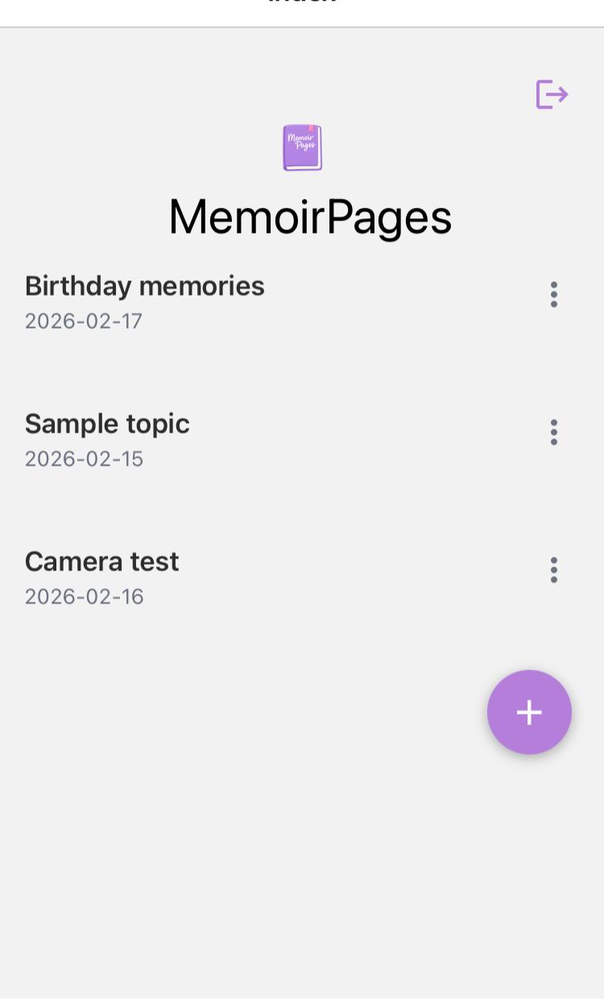
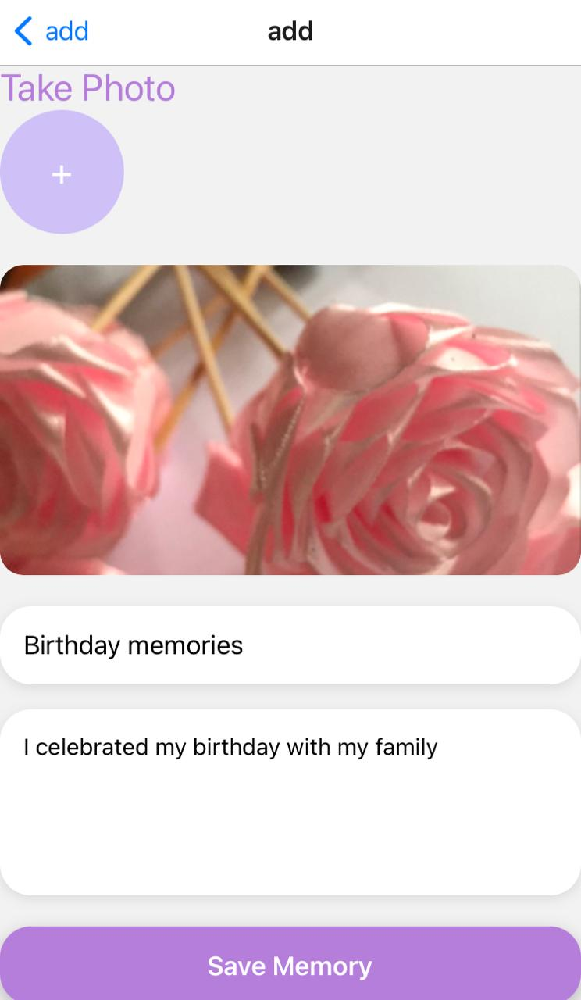
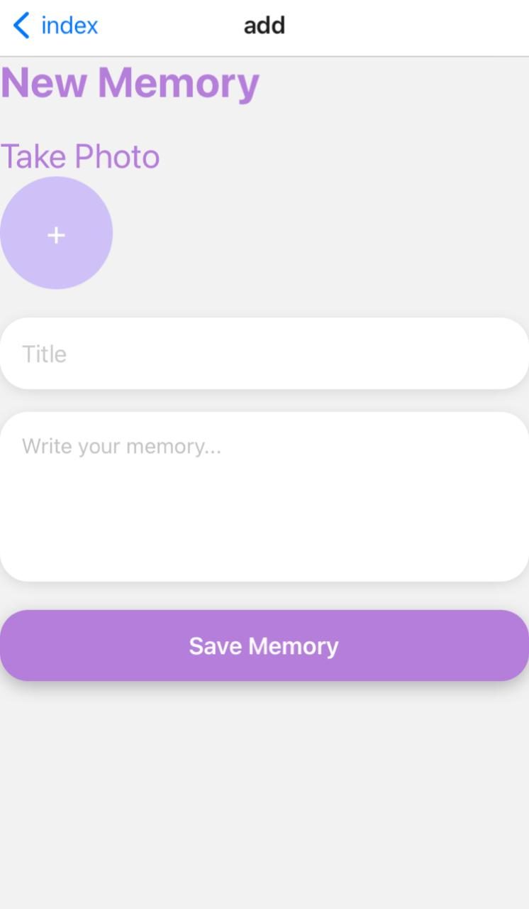
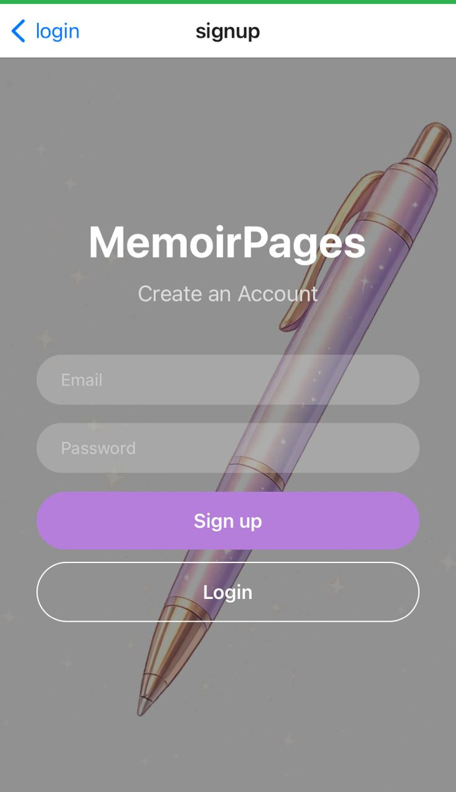
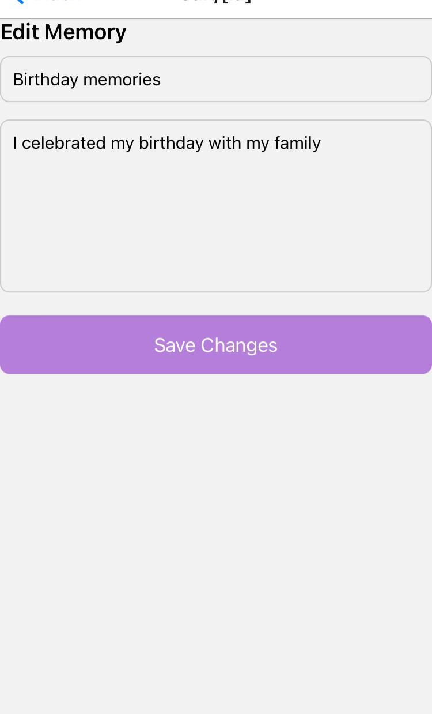
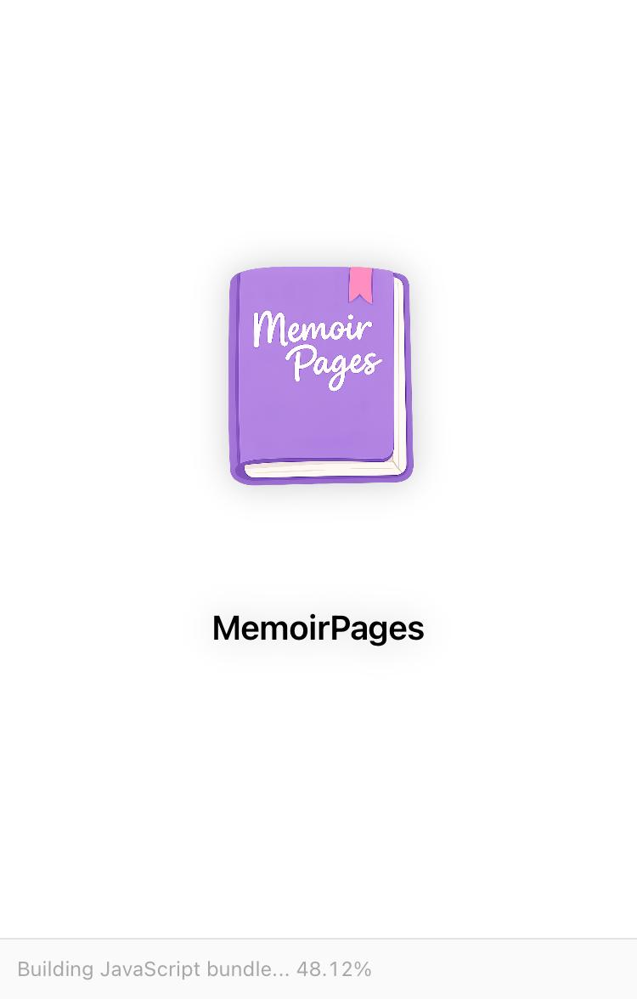

# MemoirPages  📖

MemoirPages is a personal diary app built with React Native, Expo, and Firebase, allowing users to capture memories, add titles and content, and view a beautiful dashboard of all their entries.

# ✨ **Features**

📝 Add new memories 

📸 Camera access to add photos

📅 View all saved memories in a dashboard

✏️ Edit or delete memories

🔐 User authentication using Firebase Auth

🎨 Clean, minimal, and user-friendly interface

# 🛠️ **Tech Stack**

Frontend: React Native, Expo

Routing: Expo Router

Backend / Database: Firebase Firestore, Firebase Auth

Camera & Media: Expo Camera, Expo Media Library

State Management: Local React state + memoryStore module

# ⚡ **Screenshots** 
Camera access and memory 
## 📸 Screenshots

### 🏠 Home Screen

### ✏️ Add photo (camera access) and memory

### ✏️ Add memory

### 🔐 Login Screen

### 🔐 Signup Screen

### ✏️ Edit Screen

# ⚡ **Installation & Setup**

Clone the repository

git clone https://github.com/thenurisenethma/MemoirPages.git
cd MemoirPages

Install dependencies

npm install
# or
yarn install

Firebase Setup

Create a Firebase project: Firebase Console

Enable Authentication → Email/Password

Enable Firestore Database

Copy your Firebase config to firebaseConfig.ts

Run the app

npx expo start

Open in Expo Go on your device or simulator

# 📂 Folder Structure
/MemoirPages
 ├─ /assets          # Images, icons, splash screen
 ├─ /app             # Screens & routing
 │   ├─ add.tsx      # Add Memory screen
 │   ├─ dashboard.tsx# Dashboard screen
 │   ├─ camera-test.tsx # Camera screen
 ├─ /firebaseConfig.ts
 ├─ /store           # memoryStore.ts
 ├─ /types           # Memory type definitions
 └─ package.json

# 📝 **Usage**

Open the app and log in / sign up

Press the + button to add a memory

Take a photo or skip it

Add a title and content

Tap Save Memory → memory appears on the dashboard

Tap a memory → edit or delete

# 🤝 **Contributing**

Open an issue or submit a pull request

Suggestions for UI/UX improvements, new features, or bug fixes are welcome

Make sure your code follows the existing React Native + Expo structure
